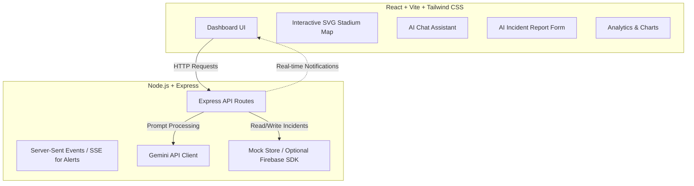

# Implementation Plan - StadiumPulse AI – Emergency Coordinator

Building a full-stack Generative AI web application called **StadiumPulse AI – Emergency Coordinator** for the FIFA World Cup 2026. The application is designed for stadium security teams, medical staff, organizers, and volunteers to detect, coordinate, and manage emergency situations in real time.

---

## User Review Required

> [!IMPORTANT]
> **Out-of-the-Box Runnability vs. Real Firebase/Google Maps Setup**
> Setting up actual Firebase Firestore, Firebase Authentication, and Google Maps API requires creating accounts, configuring Google Cloud/Firebase Consoles, and generating API keys.
> **Proposed Solution**: 
> 1. We will build a **Node.js Express backend** and **Vite + React frontend**.
> 2. The app will include **both** local mock databases (using an in-memory/JSON store) and standard Firebase configurations. This ensures the app is **instantly runnable locally** without requiring you to set up Firebase first.
> 3. We will build an **interactive custom SVG Stadium Map** that lets security staff visualize sections, routes, gates, and heatmaps in real-time. We will also include a secondary tab for Google Maps integration (with standard setup for a Google Maps API Key).
> 4. We will use a standard Gemini API key (using `@google/generative-ai`) for real-time analysis, summaries, resource allocation, and evacuation planning. The app will accept this key via an environment variable (`GEMINI_API_KEY`) or via a settings modal in the UI.

---

## Technical Architecture

---

## Proposed Changes

We will create the project inside `C:\Users\devik\.gemini\antigravity\scratch\stadiumpulse-ai`.

### 1. Backend Server (`/backend`)
A Node.js Express server to handle business logic, data persistence, and Gemini prompt engineering.

* **[NEW] [package.json](file:///C:/Users/devik/.gemini/antigravity/scratch/stadiumpulse-ai/backend/package.json)**: Node.js dependencies (`express`, `cors`, `dotenv`, `@google/generative-ai`, `firebase-admin`).
* **[NEW] [server.js](file:///C:/Users/devik/.gemini/antigravity/scratch/stadiumpulse-ai/backend/server.js)**: Main server setup, routes, and error handling.
* **[NEW] [geminiService.js](file:///C:/Users/devik/.gemini/antigravity/scratch/stadiumpulse-ai/backend/geminiService.js)**: Service layer interacting with Google Gemini API:
  - Formulating prompts to analyze raw reports (yielding severity, summary, protocols, response times, translation).
  - Smart resource allocator (calculating nearest teams and equipment needed).
  - Evacuation route planner (generating safest routes based on incident location and closed exits).
  - General chat helper for security questions.
* **[NEW] [db.js](file:///C:/Users/devik/.gemini/antigravity/scratch/stadiumpulse-ai/backend/db.js)**: Configurable data store. Fallback to an in-memory/JSON-file database if Firestore environment variables are not provided, ensuring instant setup.
* **[NEW] [.env](file:///C:/Users/devik/.gemini/antigravity/scratch/stadiumpulse-ai/backend/.env)**: Environment configuration (PORT, GEMINI_API_KEY, FIREBASE_ keys).

### 2. Frontend Web App (`/frontend`)
A responsive, rich-aesthetics Vite + React client. Uses Tailwind CSS, Lucide icons, and Recharts for custom analytics charts.

* **[NEW] [package.json](file:///C:/Users/devik/.gemini/antigravity/scratch/stadiumpulse-ai/frontend/package.json)**: Vite, React, Tailwind CSS, Lucide React, Recharts, and Canvas-Confetti (for celebration when resolving critical incidents).
* **[NEW] [tailwind.config.js](file:///C:/Users/devik/.gemini/antigravity/scratch/stadiumpulse-ai/frontend/tailwind.config.js)**: Custom theme variables supporting dark mode and the red/blue emergency theme.
* **[NEW] [src/index.css](file:///C:/Users/devik/.gemini/antigravity/scratch/stadiumpulse-ai/frontend/src/index.css)**: Core custom styling, glassmorphism utilities, and modern animations (pulse animations, alert glows).
* **[NEW] [src/App.jsx](file:///C:/Users/devik/.gemini/antigravity/scratch/stadiumpulse-ai/frontend/src/App.jsx)**: Main dashboard page routing/layout, hosting the sidebar, header, dark mode toggle, notifications center, and sub-views.
* **[NEW] [src/components/CommandCenter.jsx](file:///C:/Users/devik/.gemini/antigravity/scratch/stadiumpulse-ai/frontend/src/components/CommandCenter.jsx)**: Statistics counters (total, resolved, active, average response times), heatmaps list, response teams list (medical, security, volunteers).
* **[NEW] [src/components/IncidentForm.jsx](file:///C:/Users/devik/.gemini/antigravity/scratch/stadiumpulse-ai/frontend/src/components/IncidentForm.jsx)**: Standardized form for reporting emergencies. Uses Gemini to analyze details in real-time, generate summary, suggest protocol, and estimate response time.
* **[NEW] [src/components/StadiumMap.jsx](file:///C:/Users/devik/.gemini/antigravity/scratch/stadiumpulse-ai/frontend/src/components/StadiumMap.jsx)**: A detailed, beautiful SVG interactive layout of the MetLife Stadium (or generic FIFA World Cup stadium). Displays section grids, incident hotspots (pulsing indicator), active evacuations, closed gates, and safety routes.
* **[NEW] [src/components/ResourceAllocation.jsx](file:///C:/Users/devik/.gemini/antigravity/scratch/stadiumpulse-ai/frontend/src/components/ResourceAllocation.jsx)**: Displays Gemini-powered team assignments (e.g., medical team, security guards) and equipment checklists.
* **[NEW] [src/components/EvacuationPlanner.jsx](file:///C:/Users/devik/.gemini/antigravity/scratch/stadiumpulse-ai/frontend/src/components/EvacuationPlanner.jsx)**: Shows generated paths, estimated exit times, and visual routes to guide safety crew.
* **[NEW] [src/components/Analytics.jsx](file:///C:/Users/devik/.gemini/antigravity/scratch/stadiumpulse-ai/frontend/src/components/Analytics.jsx)**: Charts visualising daily trends, incident types, response times, and staff allocations.
* **[NEW] [src/components/ChatAssistant.jsx](file:///C:/Users/devik/.gemini/antigravity/scratch/stadiumpulse-ai/frontend/src/components/ChatAssistant.jsx)**: Collapsible sidebar showing a conversational Gemini assistant. Security staff can ask queries like: *"Show me protocol for suspicious bags"* or *"Translate: Gate 3 is closed, please move to Gate 5"*.
* **[NEW] [src/components/Translator.jsx](file:///C:/Users/devik/.gemini/antigravity/scratch/stadiumpulse-ai/frontend/src/components/Translator.jsx)**: Emergency announcement broadcaster supporting 5-language one-click translations.

---

## Verification Plan

### Automated Verification
1. Verify the Node.js backend starts without errors: `npm run start` in `backend`.
2. Verify the Vite frontend builds correctly: `npm run build` in `frontend`.
3. Verify API endpoints using standard Node fetch checks or unit tests.

### Manual Verification
1. Open the web app in the browser.
2. Submit a simulated incident report (e.g., "Fire in Section B4, thick black smoke, people running").
3. Verify Gemini classifies it as "High/Critical Severity Fire" and displays recommendations.
4. Verify the interactive SVG stadium map updates (pulsing red dot on Section B4, route lines highlighted).
5. Open the multilingual panel and click "Spanish" / "French" / "Arabic" / "Portuguese" to confirm translations.
6. Trigger an evacuation route calculation and check that routes are marked on the stadium map.
7. Converse with the AI Chat assistant regarding emergency protocols.
8. Toggle Dark/Light mode and ensure styles adhere to a modern, premium emergency operations style.
